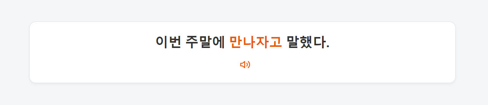
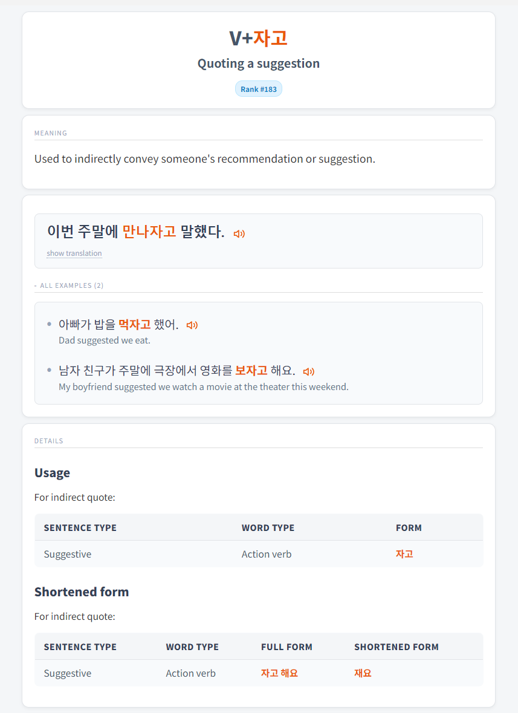
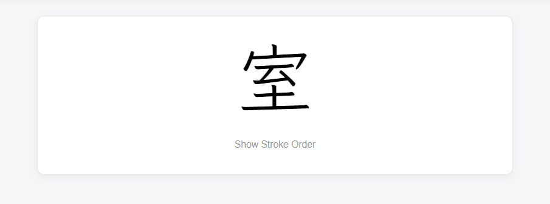
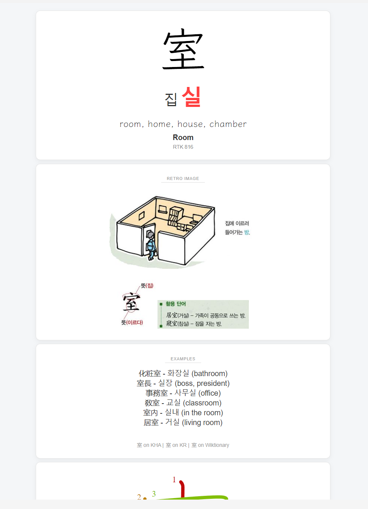
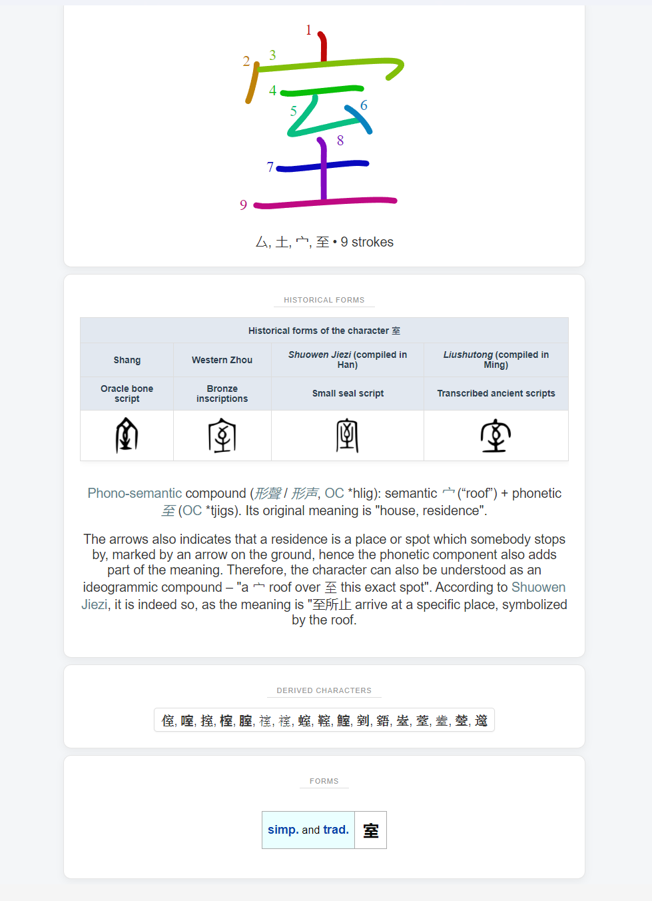
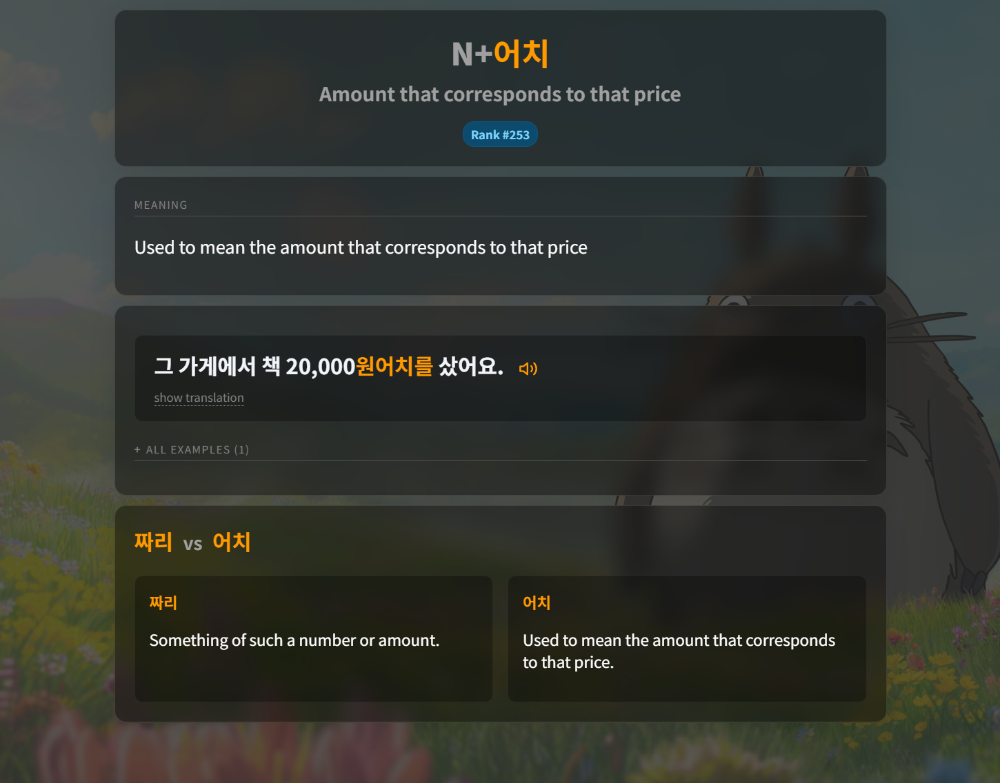

# Korean Anki Decks

## Table of Contents

- [Download](#-download)
- [Korean Grammar Deck](#korean-grammar-deck)
- [Hanja Deck](#hanja-deck)
- [User Configuration](#user-configuration)
  - [Optional Glassmorphism (CSS)](#optional-glassmorphism-css)
- [Credits](#credits)
- [License](#license)

##  Download

* **Grammar Deck**: <a href="https://drive.google.com/file/d/1O2PAZyGvjX4w7UiVjaX8BuDE71Oc6Scp/view?usp=drive_link">Download</a>
* **Hanja Deck**: <a href="https://drive.google.com/file/d/1HcRvRjV2Y_nGwVnRZi_7GW7-3k8zzrQf/view?usp=drive_link">Download</a>

## Korean Grammar Deck

This deck focuses on **Korean grammar patterns**.
Each time a card comes up, the **front** shows a **random example sentence** from the card’s sentence pool, with a **randomly selected font**.
On the **back**, the randomly selected sentence appears at the top, and you can see all other possible sentences in the **“all examples”** section.
You can **click on any highlighted grammar point**, which will link directly to the related **[Kimchi Reader](https://kimchi-reader.app/grammar) grammar page**.
There is **one card per meaning**, so if a grammar point has **three meanings**, the deck contains **three separate cards**, each with its own specific example sentences.
It is ordered by frequency, with a small gap between cards of the **same grammar point** but **different meanings**.
My **personal recommendation** is to study **no more than 2–3 cards per day**, alongside your usual reviews.
With this pace, you will finish the deck in **about 110–160 days** (**332 cards total**).

### Card previews

**Front example**

<table>
  <tr>
    
  </tr>
</table>

**Back example**

<table>
  <tr>
    

  </tr>
</table>

<strong>For more details about this deck</strong> (tags, structure, and how it was built), 
<strong><a href="https://github.com/marbaret/anki-decks/blob/main/korean/grammar/README.md">see the dedicated README here</a></strong>.

## Hanja Deck

This deck helps build **recognition and understanding of commonly used Hanja** and their usage in Korean.
It contains **multiple sections** that can be easily **enabled or disabled** to suit individual preferences directly in the **HTML** (see the [**User Configuration**](#user-configuration) section below).
It is **ordered by 한자능력검정 급수** (8급, 7급, etc.).
My personal recommendation is to study **no more than 5 cards per day**, alongside your usual reviews.
With this pace, you will finish the deck in **about one year** (**1,948 cards total**).

### Card previews

**Front example**

<table>
  <tr>
    
  </tr>
</table>

**Back example**

<table>
  <tr>
    <td></td>
    <td></td>
  </tr>
</table>

<strong>For more details about this deck</strong> (tags, structure, and how it was built), 
<strong><a href="https://github.com/marbaret/anki-decks/blob/main/korean/hanja/README.md">see the dedicated README here</a></strong>.

## User Configuration

Both decks include a <strong>USER CONFIGURATION AREA</strong> directly inside the <strong>Front</strong> and <strong>Back</strong> HTML of the cards.

This section allows you to customize the deck behavior and appearance (for example: display options, fonts, or other variables) <strong>without touching the core logic</strong>.

To modify it:

1. Open Anki
2. Go to <strong>Browse</strong> → select the deck
3. Click <strong>Cards…</strong>
4. Edit the values inside the <strong>USER CONFIGURATION AREA</strong> in the Front and/or Back HTML

### Configuration preview

### Optional Glassmorphism (CSS)

The card styling includes an <strong>optional glassmorphism effect</strong> that can be enabled or adjusted directly in the <strong>CSS</strong>.

To configure it:

1. Open <strong>Cards…</strong> in Anki
2. Go to the <strong>Styling (CSS)</strong> section
3. Delete start and end comment in the first section <em>GLASSMORPHISM OPTION</em>

<strong>How to configure</strong>

<strong>Visual result</strong>

## Credits

### Grammar Deck

This deck has been created using the GitHub repo from **[Kimchi Reader's](https://kimchi-reader.app/grammar) grammar section**.  

**I strongly encourage you to try out [Kimchi Reader](https://kimchi-reader.app/) !**  
It's the most amazing tool I've used to learn Korean and the best way to build a vocab deck using its sentence mining feature. There is a 1-week free trial, so honestly just give it a try.  

There is an amazing **[Discord server](https://discord.gg/abRkZ2hhSA)** with people who will help you if you have any questions.

- **[Kimchi Reader Grammar page](https://kimchi-reader.app/grammar)**  
- **[Kimchi Reader Grammar GitHub repo](https://github.com/Alaanor/kimchi-grammar)**

**Disclaimer**

I am **not** the creator of Kimchi Reader, and the Grammar page was **not** originally created to serve as a structured language course or a series of lessons.

The [Kimchi Reader Grammar GitHub repo](https://github.com/Alaanor/kimchi-grammar) was created by amazing contributors, and a huge thanks goes to all of them, but keep in mind that there might be some typos or minor issues.
For every update of the repo, I’ll update the Grammar deck, so you’ll just have to download it again to have the latest version.

If you have the knowledge and time to do so, I really encourage you to **contribute** to the [repo](https://github.com/Alaanor/kimchi-grammar).
For example, there are points with only **one example sentence**, and it would be amazing to have **multiple examples** for the **random sentence feature** of the deck.

### Hanja Deck

This deck was created by merging **Retro's Hanja deck**, which can be found **[here](https://drive.google.com/drive/folders/1FemoEaheHiJy2eEtTQXGU_bNj8yQipjo?usp=sharing)**  
and another deck that I unfortunately can’t find again on AnkiWeb.  

I also added fields with data scraped from **[Wiktionary](https://en.wiktionary.org/wiki/Wiktionary:Main_Page)**.  

All credits go to Retro and to the creator of the other deck.  

Find **Retro's Blog site** **[here](https://retrolearnskorean.blogspot.com/)**.

### More

If you have any questions, suggestions, or issues, don’t hesitate to contact me on Discord: **mathieu.exe**

## License

This project is licensed under <strong>Creative Commons Attribution 4.0 International (CC BY 4.0)</strong>.

You are free to:

* Share — copy and redistribute the material in any medium or format
* Adapt — remix, transform, and build upon the material

Under the following condition:

* <strong>Attribution</strong> — you must give appropriate credit.

See the <code>LICENSE</code> file for full details.
