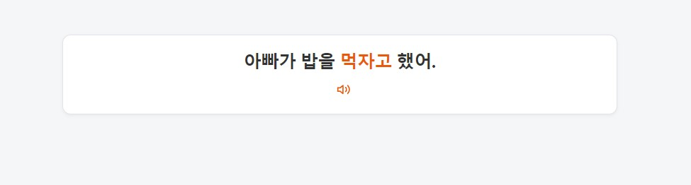
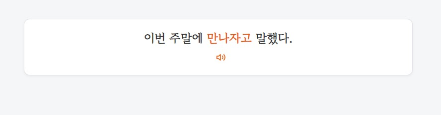
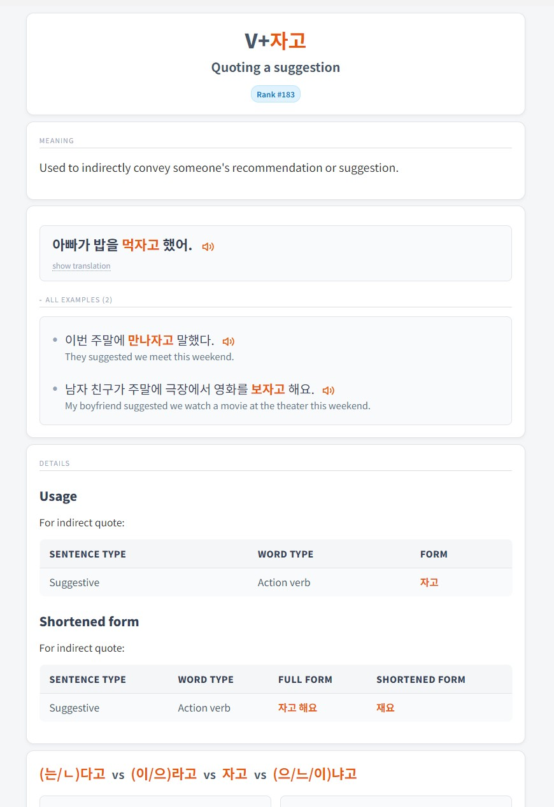
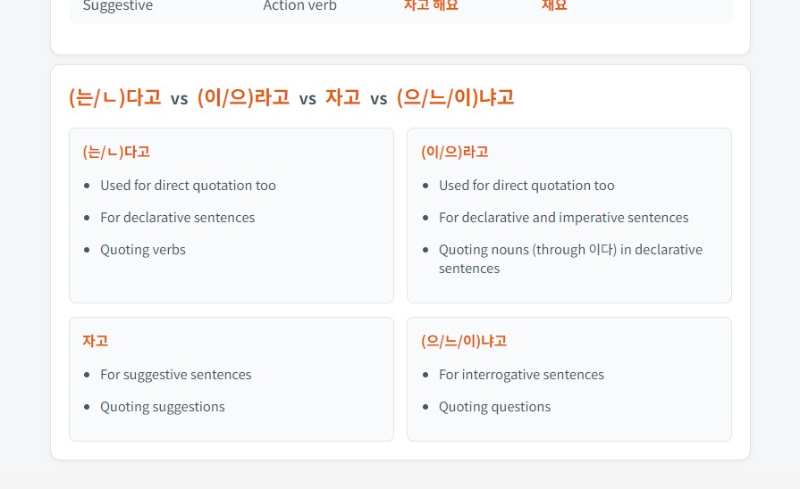
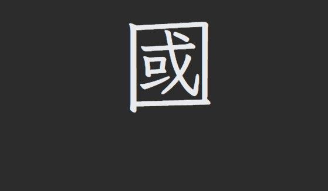
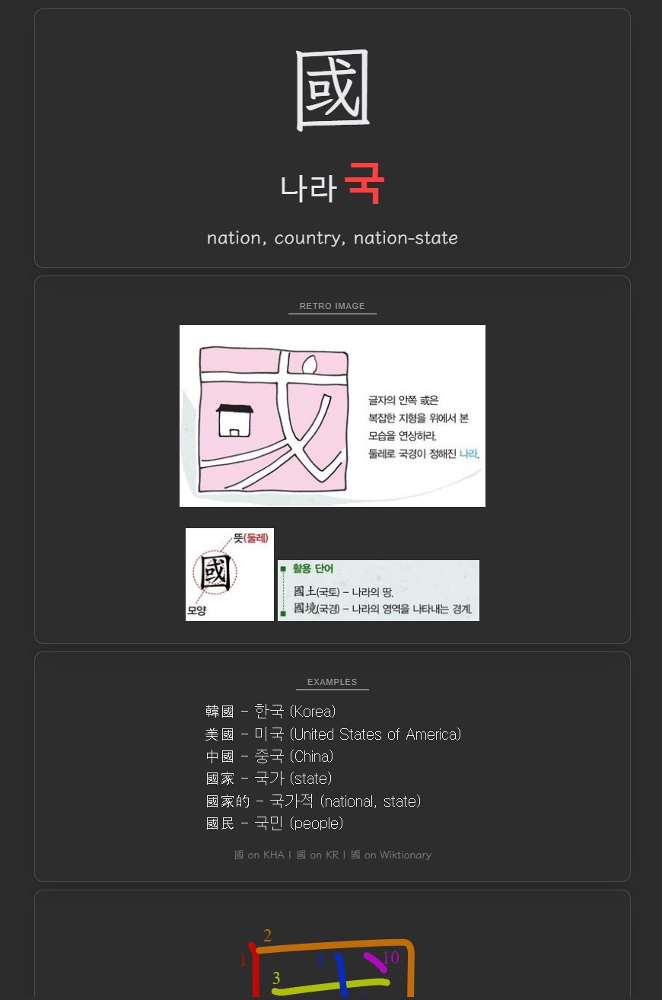
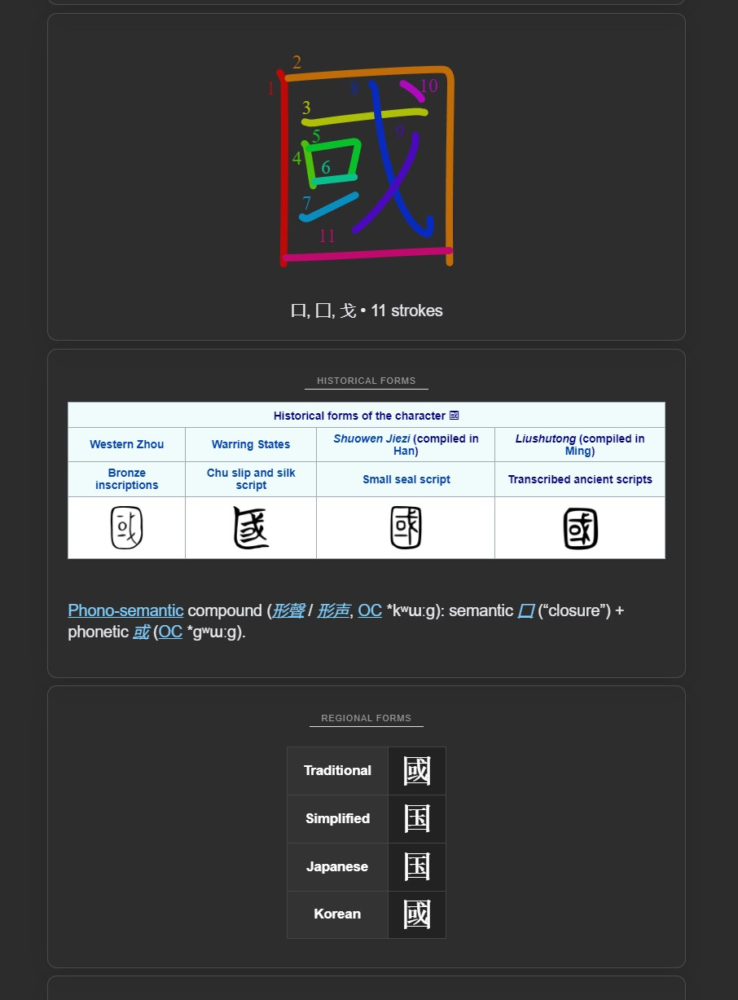
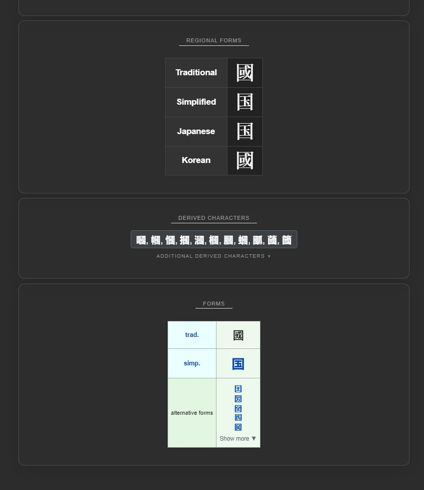
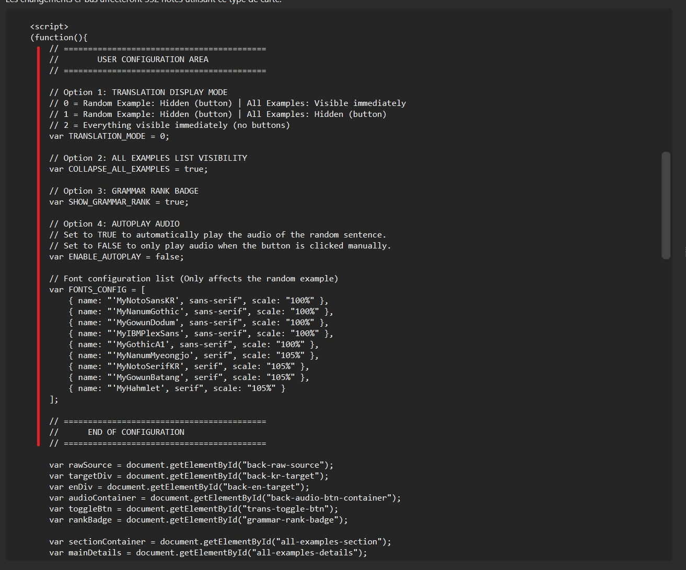
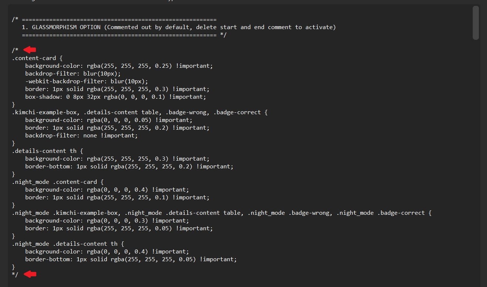

# Korean Anki Decks

## Table of Contents

- [Download](#-download)
- [Korean Grammar Deck](#korean-grammar-deck)
- [Hanja Deck](#hanja-deck)
- [User Configuration](#user-configuration)
  - [Optional Glassmorphism (CSS)](#optional-glassmorphism-css)
- [Credits](#credits)
- [License](#license)

---

## ⬇️ Download

* **Grammar Deck**: [Download](https://drive.google.com/file/d/1RzR1xQieO1rekFTK5zJq2iZrVGXTDwC3/view?usp=drive_link)
* **Hanja Deck**: [Download](https://drive.google.com/file/d/1p4fbxvJK37_ulcmK8Di9m2iZda5RqKHS/view?usp=drive_link)

## Korean Grammar Deck

This deck focuses on Korean grammar patterns with clear examples.
Each time, the front of the card shows a different random example with a randomly selected font.

### Card previews

**Front examples**

|                                            |                                            |
| ------------------------------------------ | ------------------------------------------ |
|  |  |

**Back examples**

|                                           |                                           |
| ----------------------------------------- | ----------------------------------------- |
|  |  |

**For more details about this deck** (tags, credits, structure, and how it was built),  
**[see the dedicated README here](https://github.com/marbaret/anki-decks/blob/main/korean/grammar/README.md)**.

## Hanja Deck

This deck helps build recognition and understanding of commonly used Hanja and their usage in Korean.

### Card previews

**Front examples**

|                                          |
| ---------------------------------------- | 
|  | 

**Back examples**

|                                         |                                         |                                         |
| --------------------------------------- | --------------------------------------- | --------------------------------------- |
|  |  |  |

**For more details about this deck** (tags, credits, structure, and how it was built),  
**[see the dedicated README here](https://github.com/marbaret/anki-decks/blob/main/korean/hanja/README.md)**.

## User Configuration

Both decks include a **USER CONFIGURATION AREA** directly inside the **Front** and **Back** HTML of the cards.

This section allows you to customize the deck behavior and appearance (for example: display options, fonts, or other variables) **without touching the core logic**.

To modify it:

1. Open Anki
2. Go to **Browse** → select the deck
3. Click **Cards…**
4. Edit the values inside the **USER CONFIGURATION AREA** in the Front and/or Back HTML

### Configuration preview

### Optional Glassmorphism (CSS)

The card styling includes an **optional glassmorphism effect** that can be enabled or adjusted directly in the **CSS**.

To configure it:

1. Open **Cards…** in Anki
2. Go to the **Styling (CSS)** section
3. Delete start and end comment in the first section GLASSMORPHISM OPTION

**How to configure**

**Visual result**

## Credits

## License

This project is licensed under **Creative Commons Attribution 4.0 International (CC BY 4.0)**.

You are free to:

* Share — copy and redistribute the material in any medium or format
* Adapt — remix, transform, and build upon the material

Under the following condition:

* **Attribution** — you must give appropriate credit.

See the `LICENSE` file for full details.

